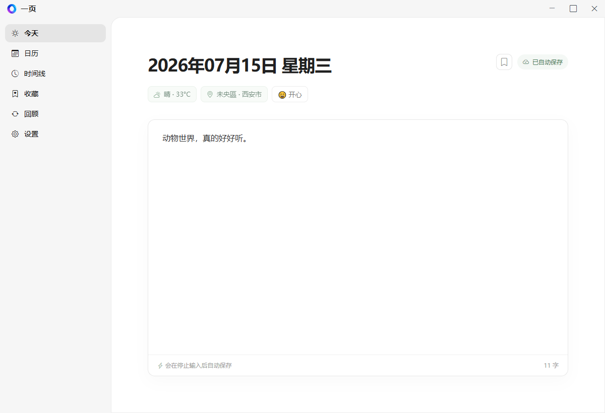
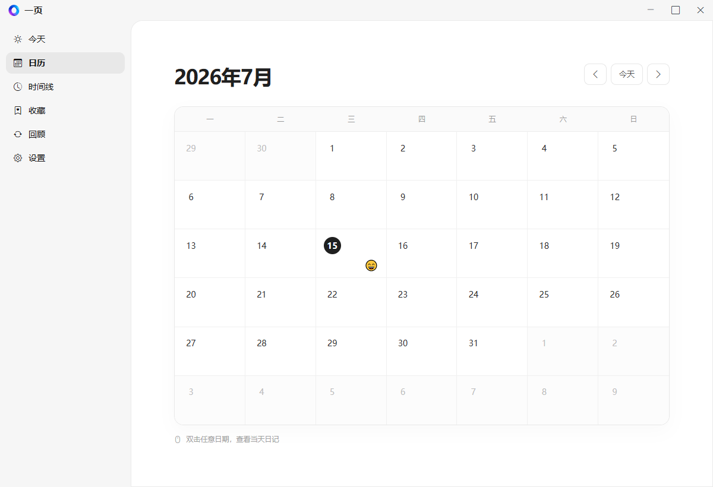
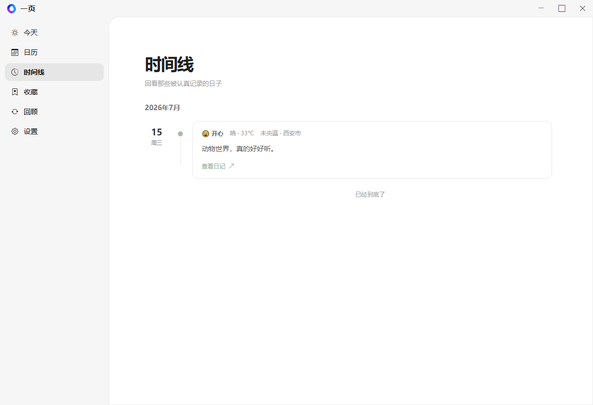
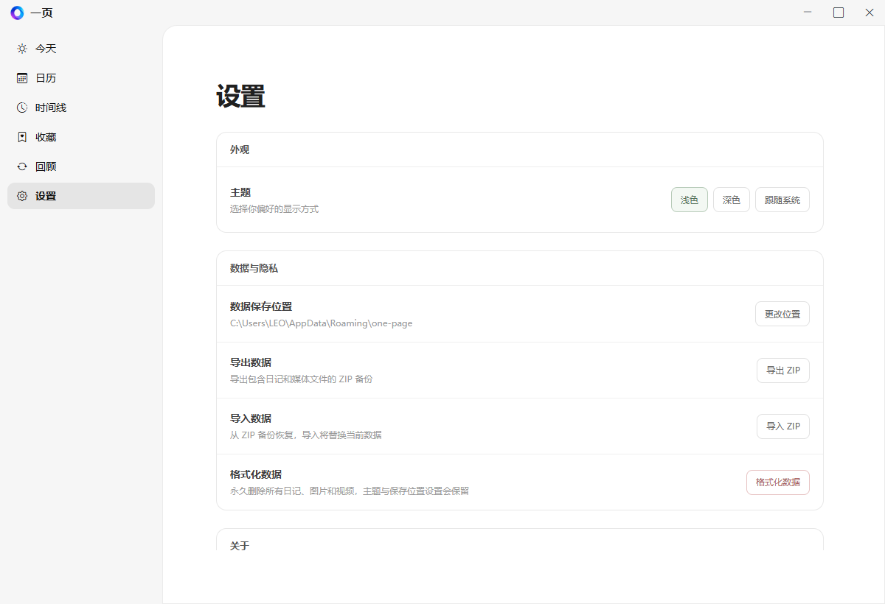

# 一页

一个本地优先的桌面日记应用。用一页，记录当天的文字、心情、天气、地点，以及值得回看的图片和视频。

## 界面预览

| 今天 | 日历 |
| --- | --- |
|  |  |

| 时间线 | 设置 |
| --- | --- |
|  |  |

## 功能

- 富文本日记，停止输入后自动保存
- 图片、视频插入，以及天气、地点、心情记录
- 日历视图、时间线、收藏与随机回顾
- 浅色、深色与跟随系统主题
- 自定义数据位置、ZIP 备份导出与导入、格式化数据
- 本地 SQLite 存储，日记数据不依赖云端服务

## 使用

发行包在 `out/make` 目录下生成：

- **安装版**：运行 `一页-1.0.0-安装程序.exe`，会创建开始菜单和桌面快捷方式，并支持自动下载、重启安装更新。
- **绿色免安装版**：解压 `一页-win32-x64-1.0.0.zip` 后，直接运行其中的 `一页.exe`。它会提示新版本，但需要下载 ZIP 并手动覆盖程序文件。

## 数据与备份

默认数据目录为：

```text
C:\Users\<用户名>\AppData\Roaming\one-page
```

从旧版本升级时，应用会自动复制 `Roaming\一页` 中的日记、媒体和设置到新目录，旧目录会保留。你也可以在「设置」中修改数据保存位置，或使用导入、导出功能进行备份。

## 本地开发

```bash
npm install
npm start
```

常用构建命令：

```bash
# 生成应用目录
npm run package

# 生成安装版和绿色免安装版
npm run make
```

## 发布新版本

1. 将 `package.json` 中的 `version` 递增，例如 `1.0.0` 改为 `1.0.1`。
2. 更新 [发布说明模板](.github/release-notes.md) 中「本次更新」的内容。
3. 提交版本变更后，推送同名标签，例如 `git tag v1.0.1` 和 `git push origin v1.0.1`。
4. GitHub Actions 会自动构建并上传 GitHub Release；安装版会从该 Release 自动更新。

也可在本机设置具有仓库 Contents 写入权限的 `GITHUB_TOKEN` 后执行 `npm run publish`。

## 技术栈

- Electron + Electron Forge
- Vite
- Tiptap
- SQLite

## 许可证

[MIT](LICENSE)
